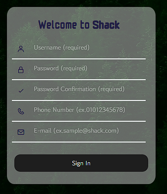

# 영화 추천 웹사이트 : Shack

<br>

## 팀원 정보 및 업무 분담 내역

<hr>

<br>
팀명 : 홍익 <br/>
팀원 : 진익근, 최홍준(팀장)<br/>
<br>

### 공통

- 영화 추천 웹사이트 서비스 구성
- 전체 로직 구상 및 구현
- 영화 추천 알고리즘 구상
- API 설계
  <br>

### 진익근

- Djaingo-Vue 연동
- 컴포넌트 설계 및 시각화
- 와이어 프레임 제작
- 전체적인 디자인 구축

### 최홍준

- 데이터 소스 구축
- 추천 알고리즘 구현
- 데이터 모델링
- ERD 설계

<br>

## 목표 서비스 구현 및 실제 구현 정도

<hr>

- Keyword 데이터 유사도를 기반으로 한 영화 추천 서비스
- 소소한 재미를 줄 수 있는 회원가입 정보를 기반으로 한 영화 추천
- 해당 영화 Detail 페이지에서 Like 한 User Data를 시각적으로 확인할 수 있는 서비스
- User Profile 페이지에서 Like 한 Movie들을 시각적으로 확인할 수 있는 서비스
- 기존 다른 서비스들과 비교하였을 때 밀리지 않을 수준의 디테일 포인트
  <br>

## 데이터베이스 모델링(ERD)

<hr>

<br>


<hr>

<br>

## 영화 추천 알고리즘에 대한 기술적 설명

<hr>

<br>

- 영화 데이터를 TMDB에서 수집하여 db로 활용

<br>


- 최초 로그인 시에 인기 있는 영화 들을 제시
- 3가지 영화를 선택하게 된다면 제출 이나 뒤로가기 선택이 가능한 페이지로 넘어가게 됨
- 뒤로가기 선택시 다른 영화들로 랜덤하게 구성됨, 제출하기 선택시 메인 페이지로 이동

<br>

<hr>


- select 창에서 선택했던 영화 3개의 키워드들을 기반으로 DB에 있는 영화들중 키워드 유사도가 가장 높은 영화 순서대로 개인의 사용자들에게 영화를 추천

<hr>

<br>


- 웹 사이트 내에서 사용자들이 좋아요를 많이 누른 순서대로 영화를 나열하고 추천

<br>


- 현재 상영하는 영화를 기준으로 추천

<hr>

<br>


- 앞으로 개봉할 영화를 기준으로 추천

<hr>

## 서비스 대표 기능에 대한 설명

<hr>


- 로그인 페이지에 Remember me 체크시, 이후 로그인 할 때 아이디가 입력 되어 있으며, Remember me 체크 또한 저장 상태로 유지

- 로그인 페이지에서도 회원 가입 페이지로 이동 가능

<br>

<hr>



- 회원가입 페이지에 핸드폰 번호와 이메일 받은 후 프로필에서 추천으로 사용

<br>

<hr>


- 프로필 페이지 상단 change image를 통해 프로필 변경 가능
- 프로필 페이지 왼쪽 하단 회원가입시 받았던 핸드폰 번호와 이메일 주소를 통해 일종의 로직을 통해 최대한 movie_id와 일치하는 숫자가 나오게 끔 하여 재미용도로 영화를 추천
- 해당 추천 영화 클릭시 영화 디테일 페이지로 이동
- 로직을 통해 만들어진 숫자가 존재하지 않는 movie_id 일시 아쉽지만 해당하는 영화가 없습니다 반환

<br>

<hr>


- 각종 영화들에 대한 정보 표현
- 영화 디테일 페이지에 좋아요 버튼을 통해 유저가 좋아요 표현 가능
- 해당 영화를 좋아하는 다른 유저들의 프로필 사진과 좋아요 수 표현

<br>

<hr>

## 느낀점

<br>

### 최홍준

```
처음에는 무작정 빨리 만들어야 된다는 생각이 강해서 db설계나 기획을 엄청 디테일하게 구상하지 않았었는데,
기획과 db설계에 시간을 많이 투자하는 것이 굉장히 중요하단걸 느겼다. 처음 하는 웹 개발 프로젝트 였기에,
어느정도 시간이 소요될지 감이 안잡혀서, 이것저것 많이 하고 싶었던 것들도 짧은 시간 때문에 포기하게 된거 같다.
특히나 자동차를 만들기 위해 바퀴와 엔진을 따로 만드는 것이 아니라 킥보드, 자전거, 오토바이, 자동차 순서로
만들어야 한다는 강사님의 말이 진정으로 뭘 의미하는지 몸소 느끼게 되었고, 하루 하루의 일정 관리가 꽤나
중요하단걸 느꼈다.
```

### 진익근

```
초기 설계 당시 기획이나 DB 모델링, Design 방향 설계 등 웹 페이지 개발 설계에 많은 시간을 투자하기 보다는
적당한 방향을 잡고, 개발을 진행하면서 지속적으로 수정해나갈 생각으로 개발을 시작하였다.
이미 만들고 난 이후에 새로운 것들을 추가하는 과정에서 꼬여서 에러나 버그가 발생할 수 있다는 것을 염두에 두지
않았다보니, 생각한대로 척척 진행할 수 없다는 것을 느꼈으며, 일정 또한 체계적인 일정 설정보다는 각 기능들을
구분하여 하루 목표치를 정해두고 진행하였으나, 생각한 것과 실제로 제작에 걸리는 시간은 크게 상이할 수 있다는
것을 느꼈다. 초기 설계 당시에 그러한 내용들을 기본적으로 염두에 두고 설계하고, 나름의 체계적인 일정 관리를
통해서 프로젝트를 진행하는 것이 얼마나 중요한 것인지 깨달을 수 있었다.
아쉬움이 남는 부분들도 많지만, 나름의 결과물을 보니 앞으로도 더 열심히 공부해서 많은 것들을 만들어보고
싶다는 생각이 들었다.
```
